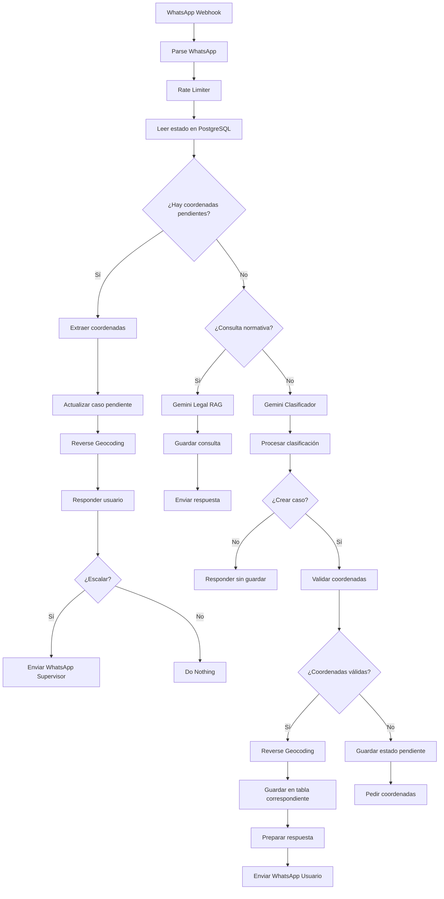

# 🌲 AI Forest Assistant

**AI Forest Assistant** es un sistema omnicanal para monitorización, alertas y gestión forestal construido con **n8n**, **Gemini AI**, **WhatsApp Business API**, **PostgreSQL/PostGIS**, **Google Maps**, **OpenWeatherMap**, **Google Sheets** y **Gmail**.

Automatiza avisos de incendio, seguimiento de plagas, solicitudes de permisos, partes de trabajo, consultas legales, escalado a supervisores, alertas meteorológicas de riesgo de incendio y reportes automáticos de métricas.

<p align="center">
  
  
  
  
  
  
</p>

---

## 📌 Índice

- [Qué hace](#-qué-hace)
- [Funcionalidades principales](#-funcionalidades-principales)
- [Arquitectura](#-arquitectura)
- [Stack tecnológico](#-stack-tecnológico)
- [Workflows](#-workflows)
- [Instalación](#-instalación)
- [Variables de entorno](#-variables-de-entorno)
- [Base de datos](#-base-de-datos)
- [Dashboard](#-dashboard)
- [Seguridad](#-seguridad)
- [Roadmap](#-roadmap)
- [Autor](#-autor)

---

## 🎯 Qué hace

El sistema permite a trabajadores forestales, brigadas, ayuntamientos o equipos de campo reportar y gestionar eventos forestales desde WhatsApp.

| Caso | Descripción |
|---|---|
| 🔥 Incendio | Detecta humo, fuego, llamas, conatos o posibles focos térmicos |
| 🐛 Plaga | Registra procesionaria, picudo rojo, escolítidos, grafiosis u otras plagas |
| 📄 Permiso | Procesa solicitudes de poda, tala, desbroce o autorización forestal |
| ⚖️ Consulta normativa | Responde preguntas sobre leyes, distancias, épocas de poda y permisos |
| 🛠️ Parte de trabajo | Registra horas, tareas realizadas y ubicación |
| 🌦️ Alerta meteorológica | Calcula riesgo de incendio con datos meteorológicos |
| 🚨 Escalado | Notifica automáticamente al supervisor en casos críticos |
| 📊 Dashboard | Genera métricas por Google Sheets, Gmail y WhatsApp |

---

## ✨ Funcionalidades principales

| Funcionalidad | Detalle |
|---|---|
| WhatsApp Business API | Canal principal de entrada y salida |
| Gemini AI | Clasificación de intención y respuestas legales |
| Máquina de estados | Asocia coordenadas posteriores con el caso pendiente |
| Reverse geocoding | Convierte coordenadas en ubicaciones legibles |
| PostgreSQL + PostGIS | Persistencia y datos geoespaciales |
| Escalado inteligente | Incendios y casos de prioridad alta notifican al supervisor |
| Dashboard automático | Métricas semanales con histórico |
| Rate limiting | Protección contra spam por usuario |
| Google Sheets | Histórico para Looker Studio o análisis rápido |

---

## 🧠 Tipos de mensaje soportados

```text
INCENDIO
PLAGA
PERMISO
INCIDENCIA
CONSULTA_NORMATIVA
PARTE_TRABAJO
OTRO
```

---

## 🏗️ Arquitectura



---

## 🔁 Máquina de estados para coordenadas pendientes

Cuando el usuario informa un caso sin coordenadas, el sistema guarda el contexto y espera la ubicación.

| Estado | Descripción |
|---|---|
| `waiting_coords` | El sistema espera coordenadas para completar un caso |
| `completed` | El caso se actualizó y el estado fue limpiado |

Ejemplo:

```text
Usuario: Hay humo en el bosque
Bot: Necesito la ubicación exacta.

Usuario: 40.4168, -3.7038
Bot: Caso completado con coordenadas.
Supervisor: Caso actualizado con ubicación.
```

---

## 🛠️ Stack tecnológico

| Herramienta | Uso |
|---|---|
| n8n | Orquestación de workflows |
| Gemini AI | Clasificación IA y RAG legal |
| WhatsApp Business API | Mensajería |
| PostgreSQL | Base de datos |
| PostGIS | Geolocalización |
| Google Maps API | Reverse geocoding |
| OpenWeatherMap | Riesgo meteorológico |
| Google Sheets | Dashboard histórico |
| Gmail | Reportes por email |

---

## 📁 Workflows

| Workflow | Archivo | Propósito |
|---|---|---|
| Core WhatsApp | `workflows/AI_Forest_Assistant_01_Core_WhatsApp.json` | Procesamiento principal de mensajes |
| Alertas clima | `workflows/AI_Forest_Assistant_02_Alertas_Clima.json` | Cálculo de riesgo de incendio |
| Dashboard | `workflows/AI_Forest_Assistant_03_Dashboard_Metricas.json` | Métricas, email, Sheets y WhatsApp |

---

## 📂 Estructura del proyecto

```text
AI-Forest-Assistant/
├── README.md
├── README.ES.md
├── LICENSE
├── workflows/
│   ├── AI_Forest_Assistant_01_Core_WhatsApp.json
│   ├── AI_Forest_Assistant_02_Alertas_Clima.json
│   └── AI_Forest_Assistant_03_Dashboard_Metricas.json
├── database/
│   ├── schema.sql
│   ├── triggers.sql
│   └── indexes.sql
└── assets/
    └── screenshots/
        ├── workflow_overview.png
        ├── fire_alert_whatsapp.png
        ├── legal_query_whatsapp.png
        ├── dashboard_metrics.png
        ├── postgres_tables.png
        ├── postgis_location.png
        ├── reverse_geocoding.png
        └── google_sheets_dashboard.png
```

---

## 🖼️ Capturas de pantalla

| Workflow | WhatsApp | Dashboard |
|---|---|---|
|  |  |  |

| PostgreSQL | PostGIS | Google Sheets |
|---|---|---|
|  |  |  |

---

## 🚀 Instalación

### 1. Requisitos previos

- n8n self-hosted o n8n Cloud
- PostgreSQL 13+ con PostGIS
- Meta for Developers con WhatsApp Business API
- Google Cloud para Gemini AI y Google Maps
- OpenWeatherMap
- Google Sheets
- Gmail

### 2. Configurar base de datos

```bash
psql -U postgres -f database/schema.sql
psql -U postgres -f database/triggers.sql
psql -U postgres -f database/indexes.sql
```

Habilita PostGIS si aún no está activo:

```sql
CREATE EXTENSION IF NOT EXISTS postgis;
```

### 3. Importar workflows

En n8n:

```text
Menú → Import from File
```

Importa los tres workflows desde la carpeta `workflows/`.

### 4. Configurar webhook de WhatsApp

| Campo | Valor |
|---|---|
| Callback URL | `https://tu-dominio.com/webhook/omnichannel-webhook` |
| Verify Token | `META_VERIFY_TOKEN` |
| Evento | Messages |

---

## 🔐 Variables de entorno

```env
GEMINI_API_KEY=
META_ACCESS_TOKEN=
META_VERIFY_TOKEN=
WHATSAPP_PHONE_NUMBER_ID=
GOOGLE_MAPS_API_KEY=
OPENWEATHER_API_KEY=
SUPERVISOR_WHATSAPP=
SUPERVISOR_EMAIL=
RATE_LIMIT_PER_MINUTE=15
```

---

## 🗄️ Base de datos

<details>
<summary><strong>forest_incidents</strong></summary>

| Columna | Tipo | Descripción |
|---|---|---|
| `id` | UUID | Clave primaria |
| `case_id` | TEXT | ID legible del caso |
| `incident_type` | TEXT | Tipo de incidente |
| `description` | TEXT | Descripción |
| `priority` | TEXT | ALTA, MEDIA, BAJA |
| `reporter_name` | TEXT | Usuario |
| `reporter_phone` | TEXT | Teléfono |
| `latitude` | DOUBLE PRECISION | Latitud |
| `longitude` | DOUBLE PRECISION | Longitud |
| `location` | GEOGRAPHY / GEOMETRY | Punto PostGIS |
| `parcela` | TEXT | Parcela |
| `status` | TEXT | Estado |
| `metadata` | JSONB | Datos adicionales |

</details>

<details>
<summary><strong>pest_cases</strong></summary>

| Columna | Tipo | Descripción |
|---|---|---|
| `id` | UUID | Clave primaria |
| `pest_type` | TEXT | Plaga o enfermedad |
| `affected_tree` | TEXT | Árbol o especie afectada |
| `description` | TEXT | Descripción |
| `latitude` | DOUBLE PRECISION | Latitud |
| `longitude` | DOUBLE PRECISION | Longitud |
| `severity` | TEXT | ALTA, MEDIA, BAJA |
| `status` | TEXT | Estado |
| `metadata` | JSONB | Datos adicionales |

</details>

<details>
<summary><strong>permits</strong></summary>

| Columna | Tipo | Descripción |
|---|---|---|
| `id` | UUID | Clave primaria |
| `permit_type` | TEXT | Tipo de permiso |
| `applicant_name` | TEXT | Solicitante |
| `applicant_phone` | TEXT | Teléfono |
| `description` | TEXT | Descripción |
| `latitude` | DOUBLE PRECISION | Latitud |
| `longitude` | DOUBLE PRECISION | Longitud |
| `urgency` | TEXT | ALTA, MEDIA, BAJA |
| `status` | TEXT | Estado |
| `metadata` | JSONB | Datos adicionales |

</details>

<details>
<summary><strong>work_reports</strong></summary>

| Columna | Tipo | Descripción |
|---|---|---|
| `id` | UUID | Clave primaria |
| `worker_name` | TEXT | Trabajador |
| `hours_worked` | DECIMAL | Horas trabajadas |
| `tasks_completed` | TEXT | Tareas |
| `location_text` | TEXT | Ubicación |
| `latitude` | DOUBLE PRECISION | Latitud |
| `longitude` | DOUBLE PRECISION | Longitud |
| `metadata` | JSONB | Datos adicionales |

</details>

<details>
<summary><strong>queries</strong></summary>

| Columna | Tipo | Descripción |
|---|---|---|
| `id` | UUID | Clave primaria |
| `case_id` | TEXT | ID de consulta |
| `query_type` | TEXT | Tipo |
| `question` | TEXT | Pregunta |
| `answer` | TEXT | Respuesta |
| `user_phone` | TEXT | Teléfono |
| `user_name` | TEXT | Usuario |
| `metadata` | JSONB | Datos adicionales |

</details>

<details>
<summary><strong>fire_alerts</strong></summary>

| Columna | Tipo | Descripción |
|---|---|---|
| `id` | UUID | Clave primaria |
| `zone_name` | TEXT | Zona |
| `temperature` | DECIMAL | Temperatura |
| `humidity` | DECIMAL | Humedad |
| `wind_speed` | DECIMAL | Viento |
| `fire_risk` | TEXT | EXTREMO, ALTO, MODERADO, BAJO |
| `alert_sent` | BOOLEAN | Alerta enviada |
| `created_at` | TIMESTAMP | Fecha |

</details>

<details>
<summary><strong>conversation_state</strong></summary>

| Columna | Tipo | Descripción |
|---|---|---|
| `user_phone` | TEXT | Teléfono |
| `current_state` | TEXT | Estado actual |
| `pending_case_id` | TEXT | Caso pendiente |
| `pending_type` | TEXT | Tipo pendiente |
| `context_data` | JSONB | Contexto |
| `created_at` | TIMESTAMP | Creación |
| `updated_at` | TIMESTAMP | Actualización |

</details>

---

## 📍 Trigger PostGIS

```sql
CREATE OR REPLACE FUNCTION update_incident_location()
RETURNS trigger AS $$
BEGIN
  IF NEW.latitude IS NOT NULL AND NEW.longitude IS NOT NULL THEN
    NEW.location := ST_SetSRID(ST_MakePoint(NEW.longitude, NEW.latitude), 4326);
  END IF;

  RETURN NEW;
END;
$$ LANGUAGE plpgsql;

CREATE TRIGGER set_incident_location
BEFORE INSERT OR UPDATE ON forest_incidents
FOR EACH ROW
EXECUTE FUNCTION update_incident_location();
```

---

## 📊 Dashboard

El workflow de métricas genera un resumen de los últimos siete días y lo envía a:

- Google Sheets
- Gmail
- WhatsApp del supervisor

### Columnas recomendadas

```text
FECHA
INCIDENTES_TOTAL
INCIDENTES_ALTA
INCIDENTES_MEDIA
INCIDENTES_BAJA
INCENDIOS
PLAGAS
PERMISOS
INCIDENCIAS
PARTES_TRABAJO
CONSULTAS_LEGALES
ALERTAS_TOTAL
ALERTAS_EXTREMO
ALERTAS_ALTO
ALERTAS_MODERADO
ALERTAS_BAJO
TOP_UBICACIONES
INCIDENTES_POR_TIPO_JSON
ALERTAS_JSON
GENERADO_EN
```

---

## 🔧 Nodos clave

| Nodo | Función |
|---|---|
| Parse WhatsApp | Normaliza texto, ubicación, imágenes y documentos |
| Rate Limiter | Limita mensajes por conversación |
| Leer Estado | Detecta si hay coordenadas pendientes |
| Gemini Clasificador | Clasifica el tipo de mensaje |
| Procesar Clasificación | Normaliza JSON y decide si crear caso |
| Validar Coordenadas | Valida latitud y longitud |
| Reverse Geocoding | Obtiene ubicación legible |
| Guardar Estado Pendiente | Guarda caso esperando coordenadas |
| Preparar Registro | Construye payload para PostgreSQL |
| Switch | Enruta a la tabla correcta |
| Preparar Respuesta Usuario | Formatea mensaje final |
| Enviar WhatsApp Supervisor | Escala casos críticos |
| Procesar Métricas | Construye dashboard semanal |

---

## 🛡️ Seguridad

- No subas `.env`.
- No hardcodees tokens.
- Usa variables de entorno.
- Filtra eventos vacíos y estados de lectura de WhatsApp.
- Mantén rate limiting activo.
- Usa RLS si conviertes el sistema en multi-tenant.
- Protege el verify token del webhook.

---

## 🧪 Ejemplos de uso

### Incendio sin coordenadas

```text
Usuario: Hay humo en el bosque
Bot: Necesito la ubicación exacta.
```

Después:

```text
Usuario: 40.4168, -3.7038
Bot: Caso completado con coordenadas.
Supervisor: Caso actualizado con ubicación.
```

### Plaga

```text
Usuario: He visto procesionaria en los pinos cerca del camino
Bot: Necesito la ubicación exacta para evaluar el alcance.
```

### Consulta normativa

```text
Usuario: ¿Puedo podar una encina en agosto?
Bot: Respuesta legal basada en el contexto normativo configurado.
```

---

## 🗺️ Roadmap

- Soporte para Instagram y Facebook Messenger
- Dashboard web en vivo
- Mapa interactivo de casos
- Detección de duplicados
- Asignación automática por zona
- Gestión de estados del caso
- Análisis de imágenes con IA
- Reportes PDF automáticos
- Multi-tenant para varias organizaciones

---

## 📄 Licencia

MIT License.

---

## 👤 Autor

**Alejandro Peralta**  
Especialista en Automatización de Procesos

- GitHub: [@alejandro-orbis](https://github.com/alejandro-orbis)
- LinkedIn: [linkedin.com/in/alejandro-orbis](https://linkedin.com/in/alejandro-orbis)
- Email: alejandro@orbisautomations.com

---

Construido con ❤️ usando n8n, Google Gemini y Meta Business API.

Creado para proteger los bosques y optimizar la gestión forestal — un mensaje a la vez.
