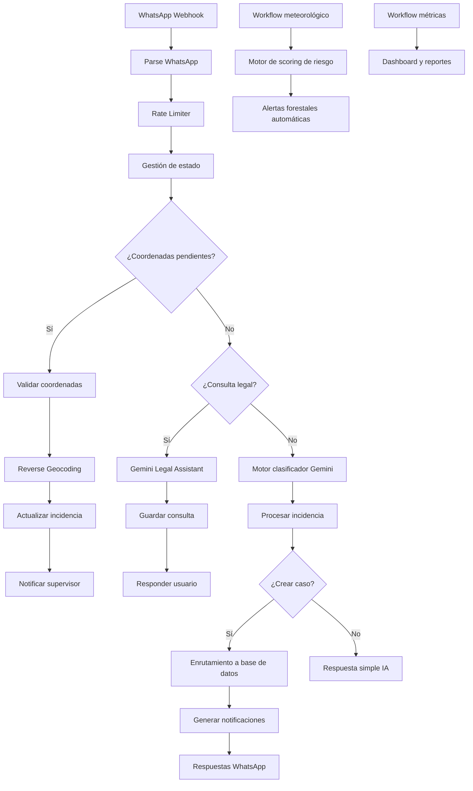

# 🌲 AI Forest Assistant

**AI Forest Assistant** es una plataforma impulsada por IA para gestión de incidencias forestales, monitorización de riesgo de incendio, asistencia legal/normativa y automatización operativa mediante **WhatsApp**, **Gemini AI**, **PostgreSQL/PostGIS**, **Google Maps**, **OpenWeatherMap**, **Google Sheets** y **n8n**.

El sistema automatiza avisos de incendio, seguimiento de plagas, solicitudes de permisos, partes de trabajo, consultas legales, escalado a supervisores, análisis meteorológico de riesgo de incendio y dashboards operativos.

Diseñado para operaciones forestales reales y gestión de incidencias ambientales.

[](https://n8n.io/)
[](https://ai.google.dev)
[](https://developers.facebook.com/docs/whatsapp)
[](https://www.postgresql.org/)
[](https://postgis.net/)
[](https://mapsplatform.google.com/)
[](https://openweathermap.org/api)
[](LICENSE)
[](https://github.com/alejandro-orbis)

---

## 🚀 Funcionalidades principales

- 🔥 Detección de incidencias de incendio con IA
- 📍 Geolocalización y reverse geocoding
- 🤖 Motor de clasificación con Gemini AI
- 📲 Flujos operativos por WhatsApp
- 🌦️ Alertas automáticas de riesgo forestal
- 📊 Dashboard y analítica
- ⚖️ Asistente legal/normativo forestal
- 🚨 Escalado automático al supervisor
- 🧠 Flujos con contexto operativo
- 🗄️ Integración PostgreSQL + PostGIS
- 📈 Métricas históricas y reportes
- 🛡️ Rate limiting y protección anti-spam

---

## 🌍 Casos de uso potenciales

- Servicios forestales municipales
- Agencias medioambientales
- Equipos de prevención de incendios
- Empresas forestales
- Respuesta rural ante emergencias
- Consultorías ambientales
- Monitorización ambiental inteligente
- Automatización operativa asistida por IA

---

## 🧠 Capacidades de IA

- Clasificación de intención
- Priorización de incidencias
- Conversaciones con contexto
- Validación de coordenadas
- Reverse geocoding
- Preguntas legales/normativas
- Escalado automático
- Enrutamiento multi-tabla
- Scoring de riesgo meteorológico
- Generación de analítica histórica

---

## 📌 Tipos de mensaje soportados

```text
INCENDIO
PLAGA
PERMISO
INCIDENCIA
CONSULTA_NORMATIVA
PARTE_TRABAJO
OTRO
```

---

## 🏗️ Arquitectura del sistema



---

## ⚙️ Workflows principales

| Workflow | Propósito |
|---|---|
| Core WhatsApp | Motor principal de procesamiento de incidencias |
| Alertas Clima | Cálculo de riesgo de incendio y alertas |
| Dashboard Métricas | Reportes semanales y analítica |

---

## 🛠️ Stack tecnológico

| Tecnología | Uso |
|---|---|
| n8n | Orquestación de workflows |
| Gemini AI | Clasificación IA y asistente legal |
| WhatsApp Business API | Mensajería |
| PostgreSQL | Base de datos |
| PostGIS | Operaciones geoespaciales |
| Google Maps API | Reverse geocoding |
| OpenWeatherMap | Scoring de riesgo meteorológico |
| Google Sheets | Dashboard histórico |
| Gmail | Reportes automáticos |

---

## 📂 Estructura del proyecto

```text
AI-Forest-Assistant/
├── README.md
├── README.ES.md
├── LICENSE
├── .env.example
├── workflows/
│   ├── AI_Forest_Assistant_01_Core_WhatsApp.json
│   ├── AI_Forest_Assistant_02_Alertas_Clima.json
│   └── AI_Forest_Assistant_03_Dashboard_Metricas.json
├── database/
│   ├── schema.sql
│   ├── triggers.sql
│   └── indexes.sql
├── docs/
│   └── database.md
└── assets/
    └── screenshots/
        ├── workflow_overview.png
        ├── fire_alert_whatsapp.png
        ├── legal_query_whatsapp.png
        ├── dashboard_metrics.png
        ├── postgres_tables.png
        ├── postgis_location.png
        ├── reverse_geocoding.png
        └── google_sheets_dashboard.png
```

---

## 🖼️ Capturas de pantalla

### 🏗️ Arquitectura del sistema

| Arquitectura modular | Core workflow |
|---|---|
|  |  |

---

### 🧠 IA y automatización

| Routing IA | Alerta de incendio |
|---|---|
|  |  |

| Consulta legal | Geolocalización de plaga |
|---|---|
|  |  |

---

### 📊 Reporting y persistencia

| Dashboard workflow | Riesgo meteorológico |
|---|---|
|  |  |

| Google Sheets | PostgreSQL |
|---|---|
|  |  |

---

## 🚀 Instalación

### 1. Requisitos

- n8n self-hosted o n8n Cloud
- PostgreSQL 13+ con PostGIS
- Meta for Developers con WhatsApp Business API
- Google Cloud para Gemini AI y Google Maps
- Cuenta de OpenWeatherMap
- Google Sheets
- Gmail

### 2. Configurar base de datos

```bash
psql -U postgres -f database/schema.sql
psql -U postgres -f database/triggers.sql
psql -U postgres -f database/indexes.sql
```

Habilita PostGIS si es necesario:

```sql
CREATE EXTENSION IF NOT EXISTS postgis;
```

### 3. Importar workflows

En n8n:

```text
Menú → Import from File
```

Importa los tres workflows desde la carpeta `workflows/`.

### 4. Configurar webhook de WhatsApp

| Campo | Valor |
|---|---|
| Callback URL | `https://tu-dominio.com/webhook/omnichannel-webhook` |
| Verify Token | `META_VERIFY_TOKEN` |
| Evento | Messages |

---

## 🔐 Variables de entorno

```env
GEMINI_API_KEY=
META_ACCESS_TOKEN=
META_VERIFY_TOKEN=
WHATSAPP_PHONE_NUMBER_ID=
GOOGLE_MAPS_API_KEY=
OPENWEATHER_API_KEY=
SUPERVISOR_WHATSAPP=
SUPERVISOR_EMAIL=
BRIGADISTAS_WHATSAPP=[]
RATE_LIMIT_PER_MINUTE=15
```

---

## 📊 Dashboard

El workflow de métricas genera un resumen semanal y lo envía a:

- Google Sheets
- Gmail
- WhatsApp del supervisor

Columnas recomendadas:

```text
FECHA
INCIDENTES_TOTAL
INCIDENTES_ALTA
INCIDENTES_MEDIA
INCIDENTES_BAJA
INCENDIOS
PLAGAS
PERMISOS
INCIDENCIAS
PARTES_TRABAJO
CONSULTAS_LEGALES
ALERTAS_TOTAL
ALERTAS_EXTREMO
ALERTAS_ALTO
ALERTAS_MODERADO
ALERTAS_BAJO
TOP_UBICACIONES
INCIDENTES_POR_TIPO_JSON
ALERTAS_JSON
GENERADO_EN
```

---

## 🔧 Nodos clave

| Nodo | Función |
|---|---|
| Parse WhatsApp | Normaliza texto, ubicación, imágenes y documentos |
| Rate Limiter | Limita mensajes por conversación |
| Gestión de estado | Detecta coordenadas pendientes |
| Gemini Clasificador | Clasifica el tipo de mensaje |
| Procesar Clasificación | Normaliza JSON y decide si crear caso |
| Validar Coordenadas | Valida latitud y longitud |
| Reverse Geocoding | Convierte coordenadas en ubicaciones legibles |
| Estado Pendiente | Guarda casos esperando coordenadas |
| Preparar Registro | Construye payloads para PostgreSQL |
| Router / Switch | Enruta a la tabla correcta |
| Preparar Respuesta Usuario | Formatea el mensaje final |
| Notificar Supervisor | Escala casos críticos |
| Procesar Métricas | Construye datos para el dashboard semanal |

---

## 🛡️ Seguridad

- No subas `.env`.
- No hardcodees tokens.
- Usa variables de entorno.
- Publica solo exports sanitizados.
- Filtra eventos vacíos y estados de lectura de WhatsApp.
- Mantén el rate limiting activo.
- Protege el verify token del webhook.
- Usa Row Level Security si conviertes el sistema en multi-tenant.
- Rota secretos antes de pasar a producción.

---

## 🧪 Ejemplos de uso

### Incendio sin coordenadas

```text
Usuario: Hay humo en el bosque.
Bot: Necesito la ubicación exacta.
```

Después:

```text
Usuario: 40.4168, -3.7038
Bot: Caso completado con coordenadas.
Supervisor: Caso actualizado con ubicación.
```

### Plaga

```text
Usuario: He visto procesionaria en los pinos cerca del camino.
Bot: Necesito la ubicación exacta para evaluar el caso.
```

### Consulta normativa

```text
Usuario: ¿Puedo podar una encina en agosto?
Bot: Respuesta legal basada en el contexto normativo configurado.
```

---

## 🗺️ Roadmap

- Soporte multicanal: Instagram y Facebook Messenger
- Dashboard web en tiempo real
- Mapa GIS interactivo
- Detección de incidencias duplicadas
- Asignación automática por zona
- Gestión avanzada de estados del caso
- Análisis de imágenes con IA
- Reportes PDF automáticos
- Motor predictivo de riesgo de incendio
- Integraciones con drones
- Reporte de incidencias por voz
- Aplicación móvil para equipos de campo
- Soporte multi-organización

---

## ⚠️ Disclaimer

Este repositorio contiene una versión pública de demostración con fines educativos y de portfolio.

Algunos workflows avanzados, prompts y componentes de producción pueden estar simplificados u omitidos intencionadamente.

El asistente legal y normativo incluido en este proyecto está diseñado para proporcionar orientación informativa fundamentada mediante contexto predefinido y respuestas generadas por IA. Sin embargo, las leyes, normativas y procedimientos administrativos pueden cambiar con el tiempo y variar según la región.

Este sistema no debe considerarse un sustituto de asesoramiento legal profesional ni de información oficial de organismos competentes.

---

## 📄 Licencia

MIT License.

---

## 👤 Autor

**Alejandro Peralta**  
Especialista en Automatización de Procesos

- GitHub: [@alejandro-orbis](https://github.com/alejandro-orbis)
- LinkedIn: [linkedin.com/in/alejandro-orbis](https://linkedin.com/in/alejandro-orbis)
- Email: [Contacto](mailto:alex_noya@hotmail.com)

---

Diseñado para operaciones forestales reales y gestión de incidencias ambientales.
