# 🌲 AI Forest Assistant

**AI Forest Assistant** is an AI-powered platform for forest incident management, wildfire risk monitoring, legal assistance and operational automation using **WhatsApp**, **Gemini AI**, **PostgreSQL/PostGIS**, **Google Maps**, **OpenWeatherMap**, **Google Sheets** and **n8n**.

The system automates wildfire alerts, pest monitoring, permit requests, work reports, legal/normative queries, supervisor escalation, weather-based wildfire risk analysis and operational dashboards.

Designed for real-world forest operations and environmental incident management.

[](https://n8n.io/)
[](https://ai.google.dev)
[](https://developers.facebook.com/docs/whatsapp)
[](https://www.postgresql.org/)
[](https://postgis.net/)
[](https://mapsplatform.google.com/)
[](https://openweathermap.org/api)
[](LICENSE)
[](https://github.com/alejandro-orbis)

---

## 🚀 Key Features

- 🔥 AI wildfire incident detection
- 📍 Geolocation & reverse geocoding
- 🤖 Gemini AI classification engine
- 📲 WhatsApp operational workflows
- 🌦️ Automated wildfire risk alerts
- 📊 Dashboard & analytics
- ⚖️ Forest legal assistant
- 🚨 Automatic escalation system
- 🧠 Context-aware operational workflows
- 🗄️ PostgreSQL + PostGIS integration
- 📈 Historical metrics & reporting
- 🛡️ Rate limiting & anti-spam protection

---

## 🌍 Potential Use Cases

- Municipal forest services
- Environmental agencies
- Wildfire prevention teams
- Forestry companies
- Rural emergency response
- Environmental consulting firms
- Smart environmental monitoring
- AI-assisted operational workflows

---

## 🧠 AI Capabilities

- Intent classification
- Incident prioritization
- Context-aware conversations
- Coordinate validation
- Reverse geocoding
- Legal/normative Q&A
- Automated escalation
- Multi-table routing
- Weather risk scoring
- Historical analytics generation

---

## 📌 Supported Incident Types

```text
INCENDIO
PLAGA
PERMISO
INCIDENCIA
CONSULTA_NORMATIVA
PARTE_TRABAJO
OTRO
```

---

## 🏗️ System Architecture

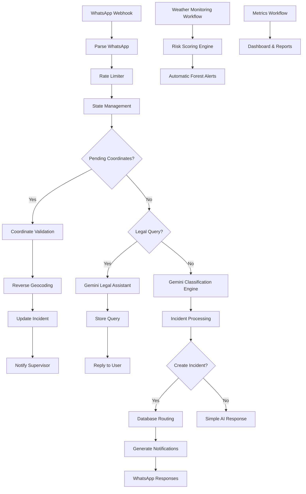

---

## ⚙️ Core Workflows

| Workflow | Purpose |
|---|---|
| Core WhatsApp | Main incident processing engine |
| Weather Alerts | Wildfire risk calculation & alerts |
| Dashboard Metrics | Weekly reports & analytics |

---

## 🛠️ Technology Stack

| Technology | Purpose |
|---|---|
| n8n | Workflow orchestration |
| Gemini AI | AI classification & legal assistant |
| WhatsApp Business API | Messaging |
| PostgreSQL | Database |
| PostGIS | Geospatial operations |
| Google Maps API | Reverse geocoding |
| OpenWeatherMap | Weather risk scoring |
| Google Sheets | Historical dashboard |
| Gmail | Automated reports |

---

## 📂 Project Structure

```text
AI-Forest-Assistant/
├── README.md
├── README.ES.md
├── LICENSE
├── .env.example
├── workflows/
│   ├── AI_Forest_Assistant_01_Core_WhatsApp.json
│   ├── AI_Forest_Assistant_02_Alertas_Clima.json
│   └── AI_Forest_Assistant_03_Dashboard_Metricas.json
├── database/
│   ├── schema.sql
│   ├── triggers.sql
│   └── indexes.sql
├── docs/
│   └── database.md
└── assets/
    └── screenshots/
        ├── workflow_overview.png
        ├── fire_alert_whatsapp.png
        ├── legal_query_whatsapp.png
        ├── dashboard_metrics.png
        ├── postgres_tables.png
        ├── postgis_location.png
        ├── reverse_geocoding.png
        └── google_sheets_dashboard.png
```

---

## 🖼️ Screenshots

### 🏗️ System Architecture

| Modular architecture | Core workflow |
|---|---|
| 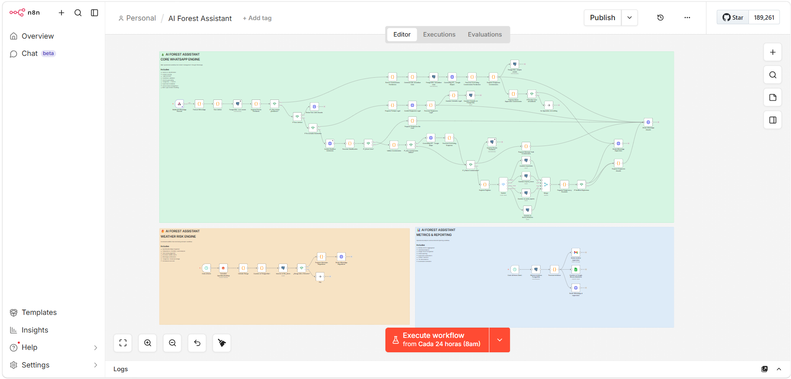 | 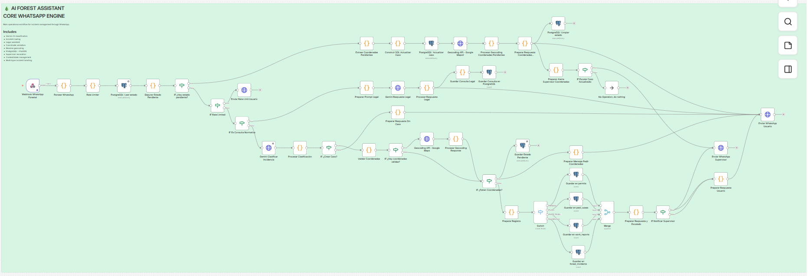 |

---

### 🧠 AI & Automation

| AI routing | Wildfire alert |
|---|---|
| 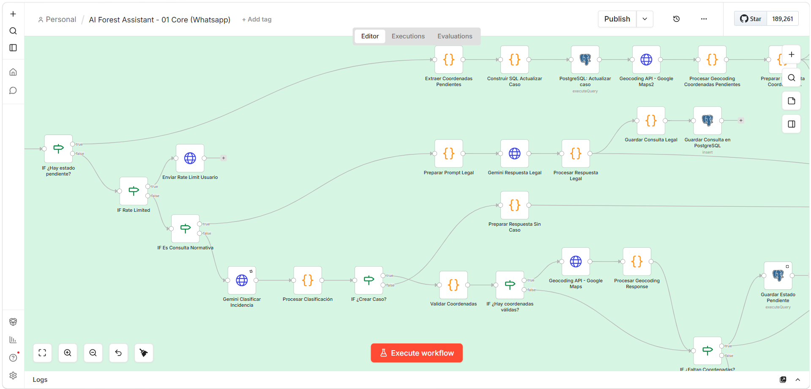 | 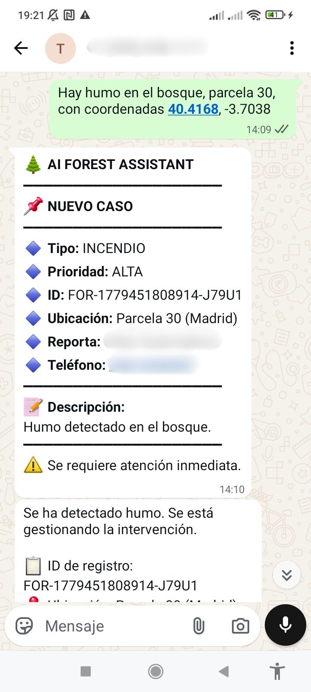 |

| Legal assistant | Pest geolocation |
|---|---|
| 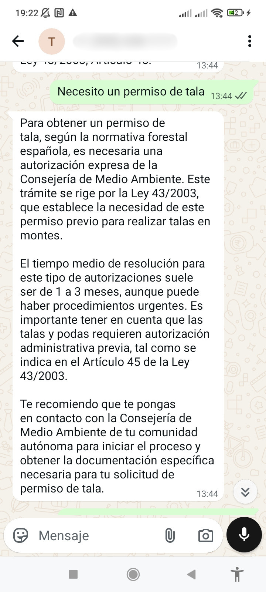 | 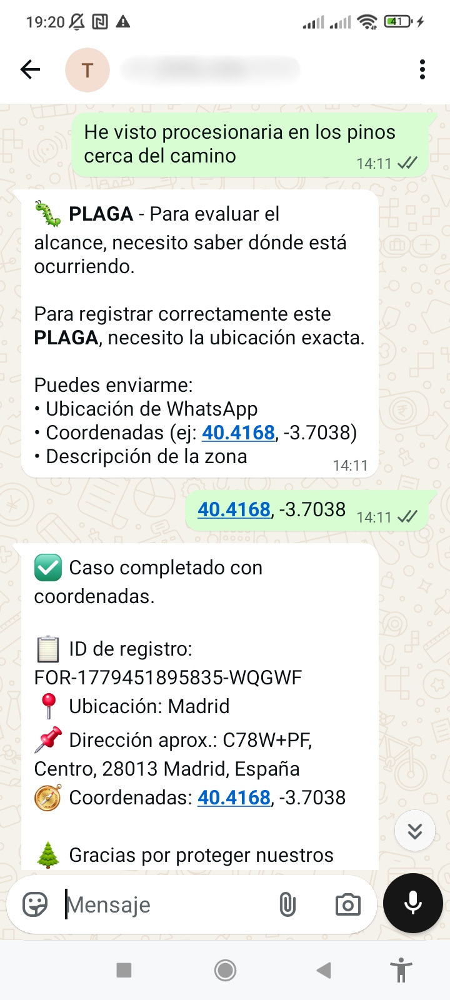 |

---

### 📊 Reporting & Persistence

| Metrics workflow | Weather risk engine |
|---|---|
| 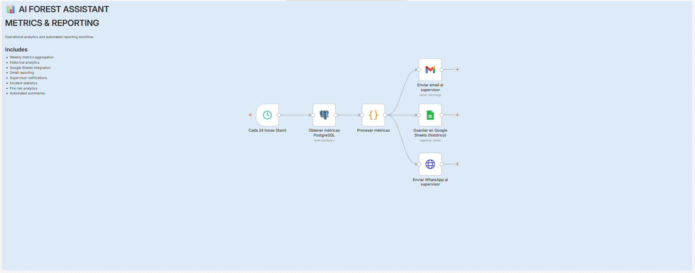 | 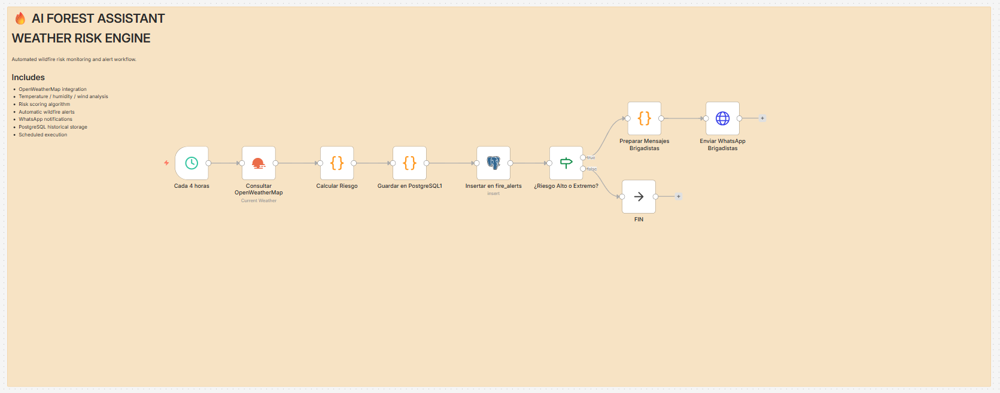 |

| Google Sheets dashboard | PostgreSQL |
|---|---|
| 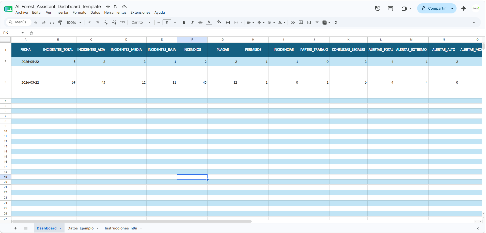 | 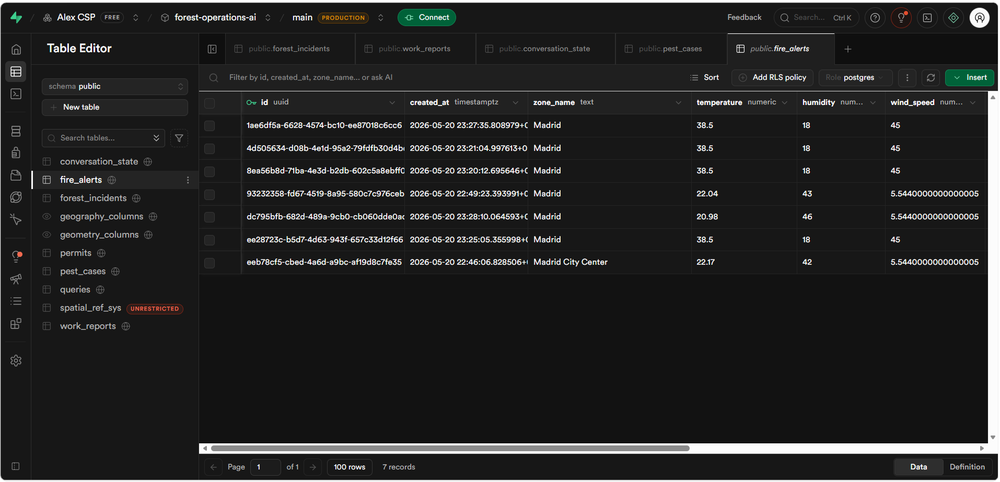 |

---

## 🚀 Installation

### 1. Requirements

- n8n self-hosted or n8n Cloud
- PostgreSQL 13+ with PostGIS
- Meta for Developers with WhatsApp Business API
- Google Cloud for Gemini AI and Google Maps
- OpenWeatherMap account
- Google Sheets
- Gmail

### 2. Configure database

```bash
psql -U postgres -f database/schema.sql
psql -U postgres -f database/triggers.sql
psql -U postgres -f database/indexes.sql
```

Enable PostGIS if needed:

```sql
CREATE EXTENSION IF NOT EXISTS postgis;
```

### 3. Import workflows

In n8n:

```text
Menu → Import from File
```

Import the three workflows from the `workflows/` folder.

### 4. Configure WhatsApp webhook

| Field | Value |
|---|---|
| Callback URL | `https://your-domain.com/webhook/omnichannel-webhook` |
| Verify Token | `META_VERIFY_TOKEN` |
| Event | Messages |

---

## 🔐 Environment Variables

```env
GEMINI_API_KEY=
META_ACCESS_TOKEN=
META_VERIFY_TOKEN=
WHATSAPP_PHONE_NUMBER_ID=
GOOGLE_MAPS_API_KEY=
OPENWEATHER_API_KEY=
SUPERVISOR_WHATSAPP=
SUPERVISOR_EMAIL=
BRIGADISTAS_WHATSAPP=[]
RATE_LIMIT_PER_MINUTE=15
```

---

## 📊 Dashboard

The metrics workflow generates a weekly summary and sends it to:

- Google Sheets
- Gmail
- Supervisor WhatsApp

Recommended dashboard columns:

```text
FECHA
INCIDENTES_TOTAL
INCIDENTES_ALTA
INCIDENTES_MEDIA
INCIDENTES_BAJA
INCENDIOS
PLAGAS
PERMISOS
INCIDENCIAS
PARTES_TRABAJO
CONSULTAS_LEGALES
ALERTAS_TOTAL
ALERTAS_EXTREMO
ALERTAS_ALTO
ALERTAS_MODERADO
ALERTAS_BAJO
TOP_UBICACIONES
INCIDENTES_POR_TIPO_JSON
ALERTAS_JSON
GENERADO_EN
```

---

## 🔧 Key Nodes

| Node | Function |
|---|---|
| Parse WhatsApp | Normalizes text, location, images and documents |
| Rate Limiter | Limits messages per conversation |
| State Management | Detects pending coordinates |
| Gemini Classifier | Classifies the message type |
| Process Classification | Normalizes JSON and decides whether to create a case |
| Coordinate Validation | Validates latitude and longitude |
| Reverse Geocoding | Converts coordinates into readable locations |
| Pending State | Stores cases waiting for coordinates |
| Prepare Record | Builds PostgreSQL payloads |
| Router / Switch | Routes to the correct table |
| Prepare User Response | Formats the final message |
| Notify Supervisor | Escalates critical cases |
| Process Metrics | Builds weekly dashboard data |

---

## 🛡️ Security

- Do not upload `.env`.
- Do not hardcode tokens.
- Use environment variables.
- Keep workflow exports sanitized before publishing.
- Filter empty WhatsApp events and status callbacks.
- Keep rate limiting enabled.
- Protect the webhook verify token.
- Use Row Level Security if turning this into a multi-tenant product.
- Rotate secrets before moving to production.

---

## 🧪 Usage Examples

### Wildfire report without coordinates

```text
User: There is smoke in the forest.
Bot: I need the exact location.
```

Then:

```text
User: 40.4168, -3.7038
Bot: Case completed with coordinates.
Supervisor: Case updated with location.
```

### Pest report

```text
User: I saw pine processionary caterpillars near the path.
Bot: I need the exact location to evaluate the case.
```

### Legal query

```text
User: Can I prune a holm oak in August?
Bot: Legal response based on the configured regulatory context.
```

---

## 🗺️ Roadmap

- Multi-channel support: Instagram and Facebook Messenger
- Real-time web dashboard
- Interactive GIS map
- Duplicate incident detection
- Automatic zone-based assignment
- Advanced case status management
- AI image analysis for forest incidents
- Automated PDF reports
- Predictive wildfire risk engine
- Drone integrations
- Voice incident reporting
- Mobile field app
- Multi-organization support

---

## ⚠️ Disclaimer

This repository contains a public demonstration version intended for educational and portfolio purposes.

Some advanced workflows, prompts and production components may be simplified or intentionally omitted.

The legal and regulatory assistant included in this project is designed to provide well-grounded informational guidance based on predefined context and AI-generated responses. However, laws, regulations and administrative procedures may change over time and may vary by region.

This system should not be considered a substitute for professional legal advice or official regulatory guidance.

---

## 📄 License

MIT License.

---

## 👤 Author

**Alejandro Peralta**  
Process Automation Specialist

- GitHub: [@alejandro-orbis](https://github.com/alejandro-orbis)
- LinkedIn: [linkedin.com/in/alejandro-orbis](https://linkedin.com/in/alejandro-orbis)
- Email: [Contact](mailto:alex_noya@hotmail.com)

---

Designed for real-world forest operations and environmental incident management.

